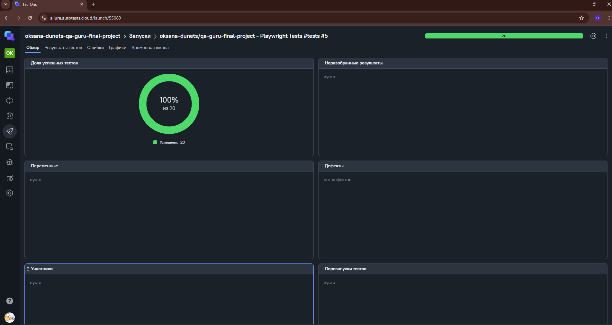
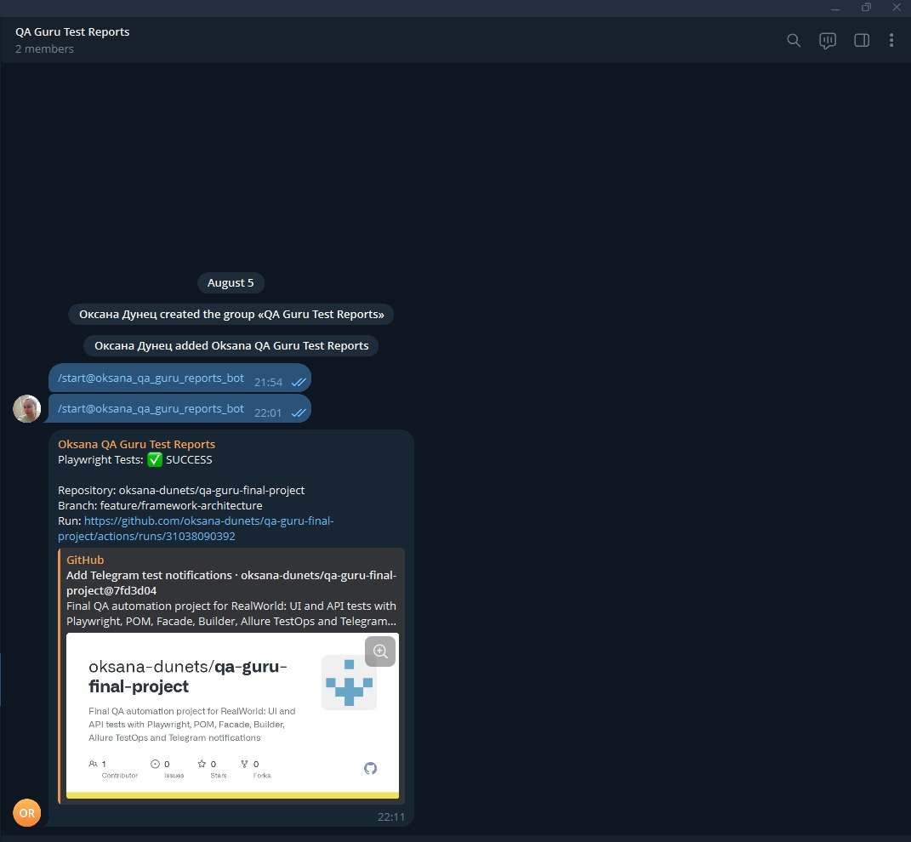
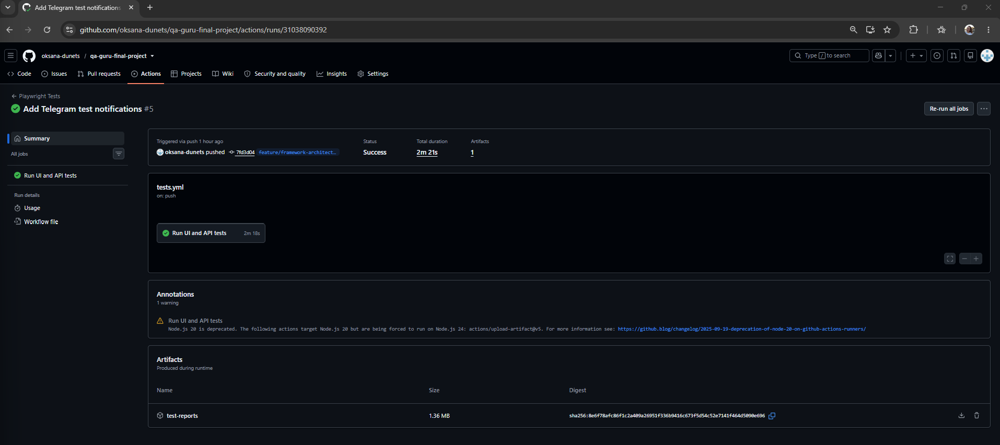

# Дипломный проект QA.GURU: UI + API автотесты

Дипломный проект по автоматизации тестирования веб-приложения RealWorld.

Проект содержит функциональные UI- и API-тесты, написанные на JavaScript с использованием Playwright. В тестовом фреймворке применены Page Object Model, Facade, Builder и Playwright fixtures.

Запуск тестов автоматизирован с помощью GitHub Actions. Результаты передаются в Allure TestOps, а итоговое уведомление отправляется в Telegram.

## Тестируемое приложение

- UI: RealWorld / Conduit
- API: RealWorld API

## Технологии

- JavaScript
- Node.js
- Playwright
- Faker
- Page Object Model
- Facade
- Builder
- Playwright fixtures
- GitHub Actions
- Allure Report
- Allure TestOps
- Telegram Bot API

## Покрытие тестами

### UI-тесты

В проекте реализовано пять функциональных UI-сценариев:

1. Создание статьи
2. Редактирование статьи
3. Удаление статьи
4. Добавление статьи в избранное
5. Изменение и сохранение профиля пользователя

UI-тесты запускаются в трёх браузерах:

- Chromium
- Firefox
- WebKit

### API-тесты

В проекте реализовано пять функциональных API-сценариев:

1. Создание и получение статьи
2. Обновление статьи
3. Добавление статьи в избранное и удаление из избранного
4. Создание, получение и удаление комментария
5. Фильтрация статей по тегу

API-тесты запускаются один раз в отдельном Playwright-проекте `api`.

Полный CI-прогон содержит 20 результатов:

- 5 API-тестов
- 5 UI-тестов в Chromium
- 5 UI-тестов в Firefox
- 5 UI-тестов в WebKit

## Структура проекта

```text
qa-guru-final-project
├── .github
│   └── workflows
│       └── tests.yml
├── docs
│   └── images
├── src
│   ├── api
│   │   └── controllers
│   ├── builders
│   ├── facades
│   ├── fixtures
│   ├── pages
│   ├── schemas
│   └── index.js
├── tests
│   ├── api
│   │   └── api.spec.js
│   └── ui
│       └── ui.spec.js
├── .env.example
├── .gitignore
├── package.json
├── playwright.config.js
└── README.md
```

## Архитектура

В проекте соблюдены следующие архитектурные принципы:

- Page Objects содержат локаторы и действия с элементами страницы.
- Controllers содержат методы для работы с API-эндпоинтами.
- Facades описывают полные бизнес-сценарии.
- Facades передаются в тесты только через Playwright fixtures.
- Builders отвечают за генерацию тестовых данных.
- Faker используется только внутри Builders.
- Assertions находятся только в тестах.
- Модули экспортируются через `index.js`.
- В проекте не используется `waitForTimeout`.
- Для ожиданий применяются встроенные механизмы Playwright.

## Установка проекта

Клонировать репозиторий:

```bash
git clone https://github.com/oksana-dunets/qa-guru-final-project.git
cd qa-guru-final-project
```

Установить зависимости:

```bash
npm ci
```

Установить браузеры Playwright:

```bash
npx playwright install
```

## Переменные окружения

Для локального запуска необходимо создать файл `.env` на основе `.env.example`:

```env
UI_BASE_URL=https://realworld.qa.guru
API_BASE_URL=https://api.realworld.show/api/

TEST_USER_EMAIL=
TEST_USER_PASSWORD=
```

В `TEST_USER_EMAIL` и `TEST_USER_PASSWORD` необходимо указать данные тестового пользователя RealWorld.

Файл `.env` содержит приватные данные и исключён из Git с помощью `.gitignore`.

В GitHub Actions настроены следующие secrets:

```text
UI_BASE_URL
API_BASE_URL
TEST_USER_EMAIL
TEST_USER_PASSWORD
ALLURE_TOKEN
TELEGRAM_BOT_TOKEN
TELEGRAM_CHAT_ID
```

Значения secrets хранятся только в настройках GitHub и не добавляются в репозиторий.

## Запуск тестов

Запустить все тесты:

```bash
npx playwright test
```

Запустить только API-тесты:

```bash
npx playwright test --project=api
```

Запустить UI-тесты в Chromium:

```bash
npx playwright test --project=chromium
```

Запустить UI-тесты в Firefox:

```bash
npx playwright test --project=firefox
```

Запустить UI-тесты в WebKit:

```bash
npx playwright test --project=webkit
```

Посмотреть список найденных тестов:

```bash
npx playwright test --list
```

Открыть HTML-отчёт Playwright:

```bash
npx playwright show-report
```

## Allure Report

Сгенерировать локальный Allure Report:

```bash
npx allure generate allure-results --clean -o allure-report
```

Открыть сгенерированный отчёт:

```bash
npx allure open allure-report
```

## CI/CD

Для автоматического запуска тестов используется GitHub Actions.

Workflow запускается:

- после push в ветку `main`;
- после push в ветку `feature/framework-architecture`;
- при создании Pull Request в `main`;
- вручную с помощью `workflow_dispatch`.

Во время выполнения workflow:

1. Репозиторий загружается на GitHub runner
2. Устанавливается Node.js
3. Настраивается `allurectl`
4. Устанавливаются зависимости проекта
5. Устанавливаются браузеры Playwright
6. Запускаются UI- и API-тесты
7. Результаты передаются в Allure TestOps
8. Генерируется Allure Report
9. Отчёты сохраняются в GitHub Artifacts
10. Результат выполнения отправляется в Telegram

[Открыть GitHub Actions](https://github.com/oksana-dunets/qa-guru-final-project/actions)

## Allure TestOps

Результаты тестов автоматически передаются в Allure TestOps с помощью `allurectl`.

В успешном запуске отображается 20 пройденных тестов:

- 5 API-тестов
- 15 UI-тестов

[Открыть запуск в Allure TestOps](https://allure.autotests.cloud/launch/55089)

> Для просмотра запуска потребуется доступ к учебной учётной записи Allure TestOps.



## Telegram-уведомления

После завершения GitHub Actions Telegram-бот отправляет сообщение в отдельную группу с отчётами.

Уведомление содержит:

- итоговый статус запуска;
- название репозитория;
- название ветки;
- ссылку на запуск GitHub Actions.



## Результат GitHub Actions

После успешного прогона GitHub Actions отображает зелёный статус workflow.


